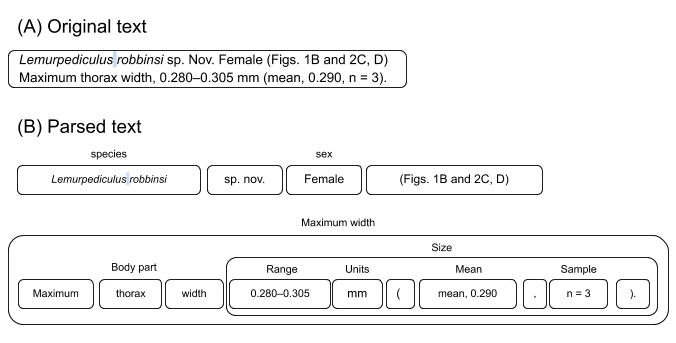

# The Traits Database Project

-- ~~If you can get away with it, you may want to try an end-to-end machine learning approach.~~

I just spent a substantial effort on a using machine learning model and I was completely wrong about the relative usefulness of rule-based and machine learning approaches to information extraction. Both have their strengths and weaknesses I am now convinced that for the next few years you will either need to use a hybrid approach or maybe a heavily trained custom model. Machine learning can do well (when not confabulating) with longer phrase traits like locality and habitat. Rule-based traits well (excepting false positives) with smaller traits and with linking traits. Both can be used as a check on the other.

## Traiter
This is the base Traiter information extraction/data mining library used by all client Traiter projects.

Some literature mined:
- PDFs containing research papers of descriptions of species.
- PDFs containing distribution data of species.
- Database downloads of field notes and species descriptions.
- Images of museum specimens. We are currently extracting data from the labels in the images.
- Data scraped from websites containing formal descriptions (treatments) of species.
- Images of PDFs of species descriptions and distribution data.
- Images of data collection notes.

**Note** All terms, traits, and extraction methods are unique to the body of literature being mined so this repository only contains truly universal terms, traits or, for that matter, functions used across many research domains.

## SpaCy Entities vs Traits:
- **A trait is just an annotated spaCy entity.** That is we're treating traits (aka attributes) as if they were their own entity. This has the advantage in that we can use named entity recognition (NER) techniques on them. We can also use standard entity link methods for linking traits to entities.
- There may (or not) be several layers of entities and traits. For instance, a plant SPECIES (a top-level entity) may have FLOWERs (a secondary or sub-entity) and those FLOWERs will have a set of characteristic COLORs (a trait).
- We leverage normal spaCy entities to build traits. Sometimes we will also use spaCy's NER entities as building block traits. (See below.)

## Parsing strategy
1. Have experts identify relevant terms and target traits.
2. We use expert identified terms to label terms using spaCy's phrase matchers. These are sometimes traits themselves but are more often used as anchors for more complex patterns of traits.
3. We then build up more complex terms from simpler terms using spaCy's rule-based matchers repeatedly until there is a recognizable trait. See the image below.
4. We may then link traits to each other (entity relationships) using spaCy's dependency matchers.
   1. Typically, a trait gets linked to a higher level entity like SPECIES <--- FLOWER <--- {COLOR, SIZE, etc.} and not peer to peer like PERSON <---> ORG.
   2. Also note that sometimes the highest level entity is assumed by its context. For instance, if a web page is a description of a newly found species then we don't need to parse the species name in the document.



## Install
You will need GIT to clone this repository. You will also need to have Python3.11+ installed, as well as pip, a package manager for Python.
You can install the requirements into your python environment like so:
```bash
git clone https://github.com/rafelafrance/traiter.git
cd /path/to/traiter
python3 -m pip install .
python3 -m spacy download en_core_web_sm
```

**I recommend using a virtual environment but that is not required.**

## Run
This repository is a library for other Traiter projects and is not run directly. Well it could be, but it's not really designed for it.

## Tests
You can run the tests like so:
```bash
cd /my/path/to/traiter
python -m unittest discover
```
